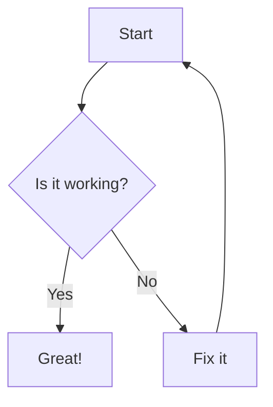

# Markdown Features Showcase

Markdown is a lightweight markup language that you can use to add formatting elements to plaintext text documents. Here's a complete list of what you can do with Markdown:

---

## 1. Headings
You can create headings by using `#` symbols:


# Heading 1
## Heading 2
### Heading 3
#### Heading 4
##### Heading 5
###### Heading 6

**Bold text**\
*Italic text*\
_Also italic_\
__Also bold__\
~~Strikethrough~~


- Item 1
- Item 2
  - Sub-item 1
  - Sub-item 2
- Item 3


1. First item
2. Second item
3. Third item
   1. Sub-item
   2. Sub-item


[Clickable link](https://example.com)


```javascript
const greet = () => {
  console.log("Hello, Markdown!");
};
```

> This is a blockquote.
> It can span multiple lines.

| Column 1 | Column 2 | Column 3 |
|----------|----------|----------|
| Data 1   | Data 2   | Data 3   |
| Data 4   | Data 5   | Data 6   |

- [x] Task 1
- [ ] Task 2
- [ ] Task 3

---
***
___

Here's a sentence with a footnote.[^1]

[^1]: This is the footnote text.

# Advanced Markdown Features

---

## 1. Mermaid Diagrams
Mermaid lets you visualize diagrams and flowcharts using text.



$$
\int_{a}^{b} f(x) \, dx = F(b) - F(a)
$$

Term 1
: Definition of Term 1

Term 2
: Definition of Term 2
: Another definition for Term 2

Term 3
: Definition of Term 3
