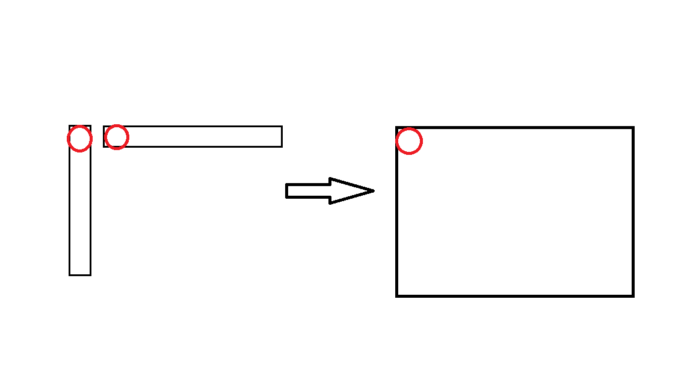

## Foundations

### Review
Recall univariate normal distributions $\mathcal{N}(\mu, \sigma^2)$

$$
p(x) = \frac{1}{Z} \exp \left( -\frac{1}{2\sigma^2} (x - \mu)^2 \right), \quad Z = \sqrt{2 \pi \sigma^2} \\

\mu = \mathbb{E}_p[x] = \int x p(x) \, dx \\

\sigma^2 = \mathbb{E}_p[(x - \mu)^2]

$$

Where $Z$ is a normalization factor that ensures the PDF integrates to 1. 

Given $\{x_i\}_{i=1}^n \sim \mathcal{N}(\mu, \sigma^2)$

We can estimate $\hat{\mu}$ and $\hat{\sigma}^2$ using equations derived from MLE. 

$$
\hat{\mu} = \frac{1}{n} \sum_{i=1}^n x_i\\

\hat{\sigma}^2 = \frac{1}{n} \sum_{i=1}^n (x_i - \hat{\mu})^2

$$

### Introduction to Multivariate Normal Distributions

Multivariate Normal Distributions are:
- A generalization of the normal distribution from one variable (univariate) to multiple (multivariate) interdependent variables simultaneously. 
- This allows us to capture relationships (correlations) between them.

Instead of a single 1-dimensional x value, we have a d-dimensional x vectors where each element is part of a separate distribution. 

$$
\mathbf{x} = \begin{bmatrix} x_1 \\ \vdots \\ x_d \end{bmatrix} \in \mathbb{R}^d\\
$$

We model this with the PDF

$$
p(\mathbf{x}) = P([x_1, \ldots, x_d])
$$

Which must satisfy the same two conditions as other PDFs

$$
\text{1. } p(\mathbf{x}) \geq 0\\

\text{2. } \int_{\mathbb{R}^d} p(\mathbf{x}) \, d\mathbf{x} = 1
$$

We parameterize the multivariate PDFs with a mean vector $\mu$ and a covariance matrix $\Sigma$.
- The mean vector is the mean of each coordinate. The expectation of each coordinate is the same as how you would calculate the expectation of any randome variable. 
- It is d x 1 dimmensional.

$$
\mu = \mathbb{E}_p[\mathbf{x}] = \begin{bmatrix} \mathbb{E}_p[x_1] \\ \vdots \\ \mathbb{E}_p[x_d] \end{bmatrix}\\

\mathbb{E}_p[x_i] = \int p(\mathbf{x}) x_i \, d\mathbf{x}

$$

- The covariance matrix is dxd

$$
\Sigma = \begin{bmatrix} \text{cov}(x_i, x_j) \end{bmatrix}_{ij}\\

\text{cov}(x_i, x_j) = \mathbb{E}[(x_i - \mu_i)(x_j - \mu_j)]

$$

The covariance matrix is symmetric
$$
\Sigma = \begin{bmatrix} \sigma_{11} & \sigma_{12} \\ \sigma_{21} & \sigma_{22} \end{bmatrix} \\

\sigma_i = \mathbb{E}[(x_i - \mu_i)^2] = \sigma^2 \quad \text{along diagonal}\\

\sigma_{ij} = \mathbb{E}[(x_i - \mu_i)(x_j - \mu_j)] = \text{cov}(x_i, x_j)

$$

 

We then write the PDF as follows:
$$
p(\mathbf{x}) = \frac{1}{Z} \exp \left( -\frac{1}{2} \boxed{(\mathbf{x} - \mu)^T \Sigma^{-1} (\mathbf{x} - \mu)} \right), \quad Z = (2\pi)^{d/2} \sqrt{\text{det}(\Sigma)}
$$

Notice that the boxed terms inside the exponent are in quadratic form.

